# 🧣 Sheen Bazaar

> *A digital marketplace for authentic Kashmiri handicrafts — connecting artisans directly with customers.*

**Developed by:** Hakim Mohammad Iisa  
**Institution:** Manipal University Jaipur  
**Platform:** Flutter (Android)  
**Backend:** Firebase (Auth, Firestore, Storage)

---

## 📸 Screenshots

<p float="left">
  
  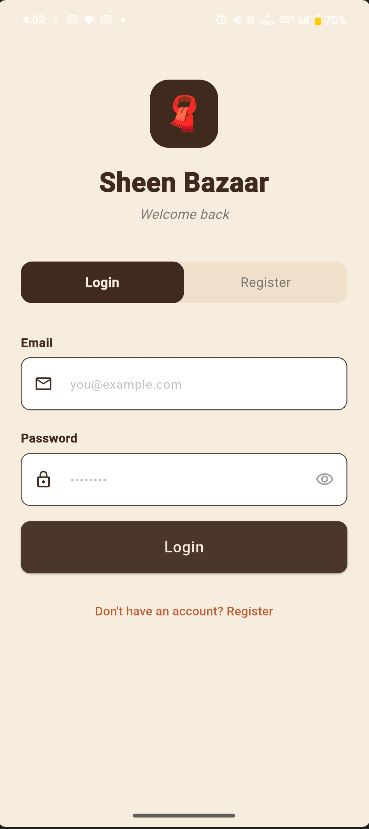
  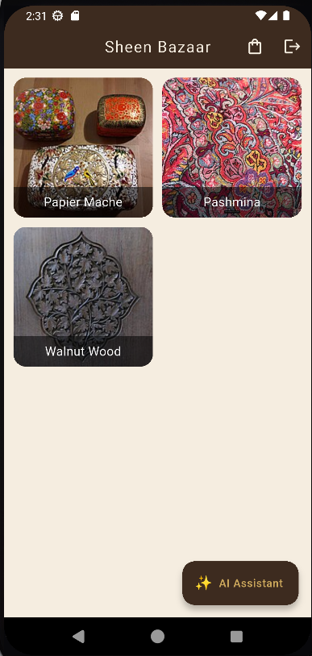
  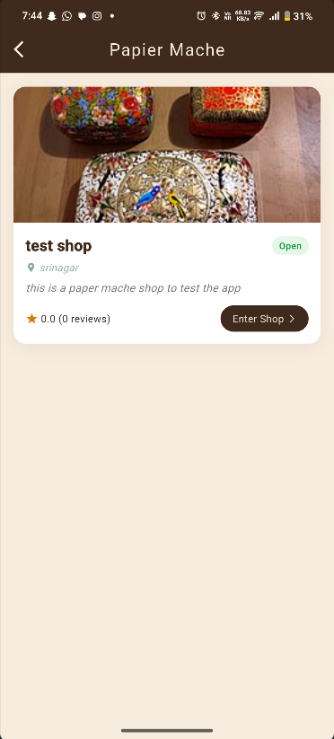
</p>

<p float="left">
  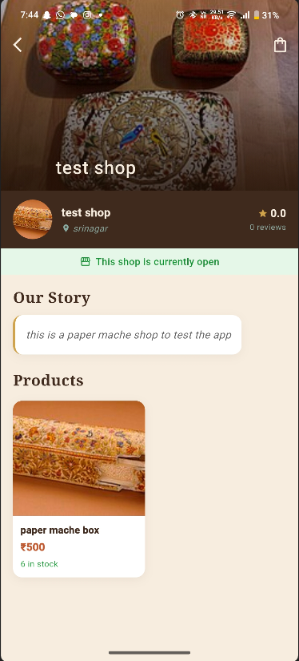
  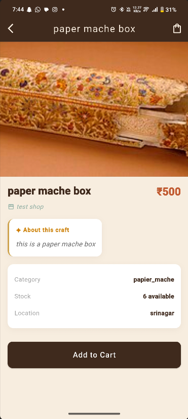
  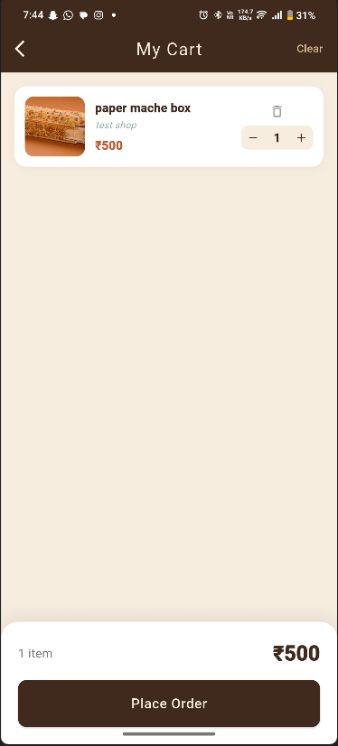
  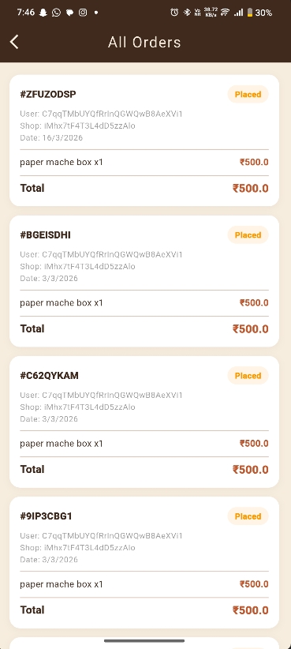
</p>

<p float="left">
  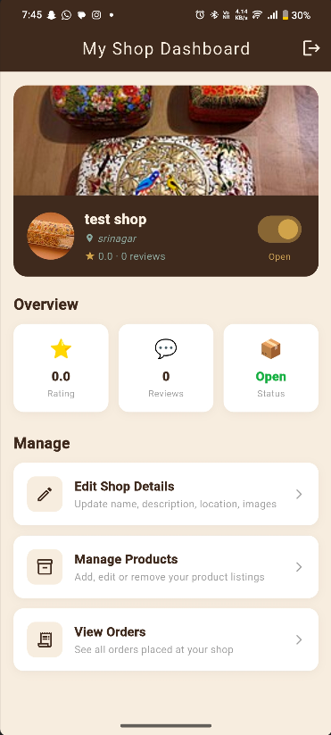
  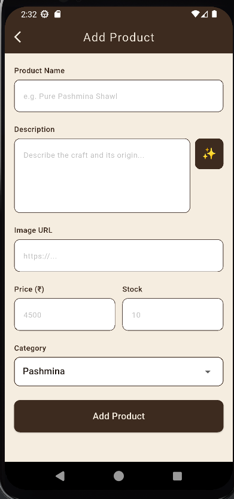
  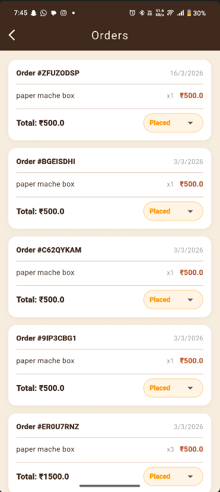
  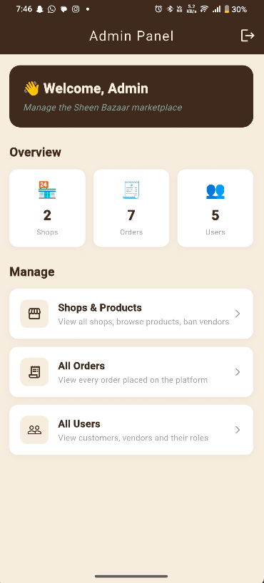
</p>

---

## ✨ Features

### 👤 Customer
- Browse Kashmiri handicraft categories (Pashmina, Papier Mache, Walnut Wood)
- Explore shops by category with artisan stories
- View detailed product descriptions and pricing
- Add multiple products to cart from different shops
- Place orders with a single tap
- Track order status in real time (Placed → Confirmed → Dispatched → Delivered)
- View complete order history with visual progress tracker
- **✨ AI Shopping Assistant** — type natural language queries like "traditional Kashmiri gift under ₹2000" and get intelligent product recommendations

### 🧑‍🎨 Vendor / Shop Owner
- Create and manage their own shop profile
- Add, edit and delete product listings
- **✨ AI Description Generator** — enter a product name and let AI write a rich, authentic Kashmiri craft description instantly
- Toggle shop open/closed status
- View and update incoming customer orders in real time

### 🛡️ Admin
- View live platform statistics (total shops, orders, users)
- Browse all shops and their products
- Ban or unban vendor shops
- View all orders placed on the platform
- View all registered users and their roles

---

## 🤖 AI Features

### ✨ AI Shopping Assistant (Customer)
Powered by Claude (Anthropic), the AI Shopping Assistant helps customers find products using natural language:

- Understands intent from conversational queries
- Fetches real-time product catalog from Firestore
- Suggests matching products with explanations
- Filters intelligently by price, category and type
- Maintains conversation context within the session

**Example queries:**
> "I want a traditional Kashmiri gift under ₹2000"  
> "Show me pashmina shawls"  
> "What wooden crafts do you have?"

### ✨ AI Description Generator (Vendor)
Vendors can generate rich, authentic product descriptions with one tap:

- Enter the product name and select category
- Tap the ✨ button next to the description field
- Claude generates a culturally rich, detailed description instantly
- Highlights handmade nature and cultural significance of the craft

---

## 🏗️ Architecture
```
sheen_bazaar/
├── lib/
│   ├── main.dart                  # App entry, Firebase init, Provider, Theme
│   ├── app_router.dart            # Entry point → SplashScreen
│   ├── models/
│   │   ├── category_model.dart
│   │   ├── shop_model.dart
│   │   └── product_model.dart
│   ├── services/
│   │   ├── category_service.dart
│   │   ├── shop_service.dart
│   │   └── claude_service.dart    # Claude API integration
│   ├── providers/
│   │   └── cart_provider.dart     # Global cart state (Provider)
│   ├── config/
│   │   └── api_config.dart        # API keys (excluded from Git)
│   └── screens/
│       ├── splash_screen.dart     # 3s branded splash + auth routing
│       ├── auth/
│       │   └── login_page.dart
│       ├── customer/
│       │   ├── customer_home.dart
│       │   ├── shops_list.dart
│       │   ├── shop_detail.dart
│       │   ├── product_detail.dart
│       │   ├── cart_screen.dart
│       │   ├── cart_icon_button.dart
│       │   ├── order_history.dart
│       │   └── ai_assistant.dart  # AI Shopping Assistant ✨
│       ├── shop_owner/
│       │   ├── shop_dashboard.dart
│       │   ├── create_shop.dart
│       │   ├── manage_products.dart  # AI Description Generator ✨
│       │   └── vendor_orders.dart
│       └── admin/
│           ├── admin_panel.dart
│           ├── admin_shops.dart
│           ├── admin_orders.dart
│           └── admin_users.dart
├── assets/
│   └── images/
│       └── splash_bg.jpg          # Kashmiri autumn background
└── pubspec.yaml
```

---

## 🔥 Firebase Schema

### `categories/{categoryId}`
```
name        : String   — "Pashmina"
icon        : String   — "shawl"
image       : String   — URL
```

### `shops/{shopId}`
```
shopName      : String
description   : String
categoryId    : String
ownerId       : String   — Firebase Auth UID
coverImage    : String   — URL
logo          : String   — URL
location      : String
isOpen        : Boolean
rating        : Number
totalReviews  : Number
createdAt     : Timestamp

  └── products/{productId}
        name        : String
        description : String
        image       : String   — URL
        price       : Number
        stock       : Number
        categoryId  : String
        createdAt   : Timestamp
```

### `orders/{orderId}`
```
userId    : String   — Firebase Auth UID
shopId    : String
status    : String   — "placed" | "confirmed" | "dispatched" | "delivered"
total     : Number
createdAt : Timestamp
items     : Array
  └── [ { productId, name, price, qty, image } ]
```

### `users/{userId}`
```
name      : String
email     : String
phone     : String
role      : String   — "customer" | "shop_owner" | "admin"
createdAt : Timestamp
```

---

## 🚀 Installation Guide

### Prerequisites
- Flutter SDK (3.x or above)
- Android Studio or VS Code
- Firebase account
- Anthropic API key ([console.anthropic.com](https://console.anthropic.com))
- Git

### Steps

**1. Clone the repository**
```bash
git clone https://github.com/your-username/sheen-bazaar.git
cd sheen-bazaar
```

**2. Install dependencies**
```bash
flutter pub get
```

**3. Firebase Setup**
- Create a new Firebase project at [console.firebase.google.com](https://console.firebase.google.com)
- Enable **Authentication** (Email/Password)
- Enable **Cloud Firestore**
- Enable **Firebase Storage**
- Download `google-services.json` and place it in `android/app/`
- Run `flutterfire configure` to generate `lib/firebase_options.dart`

**4. API Key Setup**

Create `lib/config/api_config.dart`:
```dart
class ApiConfig {
  static const String claudeApiKey = 'your-claude-api-key-here';
}
```

> ⚠️ This file is excluded from Git via `.gitignore` to protect your API key.

**5. Firestore Indexes**

Create these composite indexes in Firebase Console → Firestore → Indexes:

| Collection | Field 1 | Field 2 | Order |
|------------|---------|---------|-------|
| orders | shopId (Asc) | createdAt (Desc) | Collection |
| orders | userId (Asc) | createdAt (Desc) | Collection |

**6. Run the app**
```bash
flutter run
```

### Setting up Admin Account
1. Register normally through the app
2. Go to Firebase Console → Firestore → `users`
3. Find your user document
4. Change `role` field from `"customer"` to `"admin"`
5. Log out and log back in

---

## 🛠️ Tech Stack

| Technology | Usage |
|------------|-------|
| Flutter | Cross-platform UI framework |
| Dart | Programming language |
| Firebase Auth | User authentication |
| Cloud Firestore | NoSQL database |
| Firebase Storage | Image storage |
| Provider | State management (cart) |
| Claude API (Anthropic) | AI Shopping Assistant + Description Generator |
| http | REST API calls to Claude |
| image_picker | Image selection from gallery |

---

## 🔮 Future Scope

- Payment gateway integration (Razorpay / UPI)
- Augmented Reality product preview
- Multilingual support (Urdu, Hindi, Kashmiri)
- Push notifications for order updates
- Vendor analytics dashboard
- Customer reviews and ratings system
- Firebase Storage for direct image uploads
- AI-powered "You might also like" recommendations

---

## 📄 License

This project was developed as an academic major project at **Manipal University Jaipur**.  
© 2026 Hakim Mohammad Iisa. All rights reserved.
```

